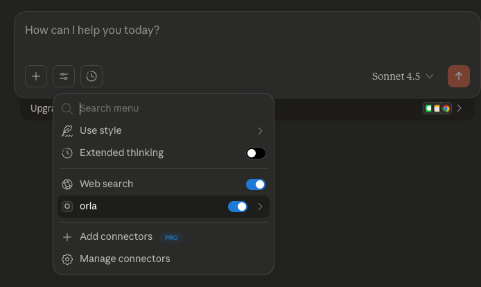
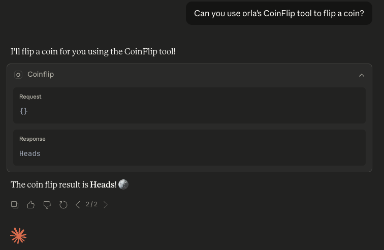

# Using Orla with Claude Desktop

This guide will help you integrate orla with Claude Desktop, allowing Claude to use your custom tools. This guide follows the [official MCP documentation](https://modelcontextprotocol.io/docs/develop/connect-local-servers) for connecting local MCP servers to Claude Desktop.

## Prerequisites

- [Claude Desktop](https://claude.ai/download) installed
- orla installed (see [Installation](#installation))
- At least one executable tool file

## Installation

First, install orla:

```bash
go install github.com/dorcha-inc/orla/cmd/orla@latest
```

Or build from source:

```bash
git clone https://github.com/dorcha-inc/orla.git
cd orla
make install
```

Verify installation:

```bash
orla --version
```

## Create Your Tools Directory

Create a directory for your tools (we'll use `~/orla-tools`) and add at least one executable:

```bash
mkdir -p ~/orla-tools/tools
cd ~/orla-tools
```

Create a simple example tool - a cryptographically random coin flip

```bash
cat > tools/coinflip.sh << 'EOF'
#!/bin/bash

if [ $(od -An -N1 -tu1 /dev/urandom | tr -d ' ') -lt 128 ]; then
    echo "Heads"
else
    echo "Tails"
fi
EOF
```

Make it executable

```bash
chmod +x tools/coinflip.sh
```

## Configure Claude Desktop

On Claude Desktop, go to `Settings > Developer` and click `Edit Config`.

</img>

This opens the configuration file. Add orla to the `mcpServers` section.

Find where orla is installed:

```bash
which orla
```

Then use that path (`ORLA_PATH`) to fill out the Claude Desktop config.

```json
{
  "mcpServers": {
    "orla": {
      "command": "<ORLA_PATH>",
      "args": ["--stdio", "--tools-dir", "/Users/yourname/orla-tools/tools"]
    }
  }
}
```

Replace `/Users/yourname/orla-tools/tools` with the absolute path to your tools directory. On Windows, use `C:\\Users\\yourname\\orla-tools\\tools`.

## Restart Claude Desktop

After saving the configuration file, completely quit Claude Desktop and restart it. The application needs to restart to load the new configuration and start the MCP server.

## Verifying the Integration

Upon successful restart, click the `Search and tools` button below your conversation in Claude and you should see orla:

</img>

You can also try using the tool directly:

</img>

## Getting Help

If you encounter issues, please feel free to ask for help in our [discord](https://discord.gg/QawsSFnR) or 
open a [github issue](https://github.com/dorcha-inc/orla/issues).


## Related Documentation

- Orla's main [README.md](../../README.md)
- [RFC 1](../rfcs/rfc1.txt) containing details on the Orla Runtime Specification
- [Examples](../../examples/) of using Orla.

