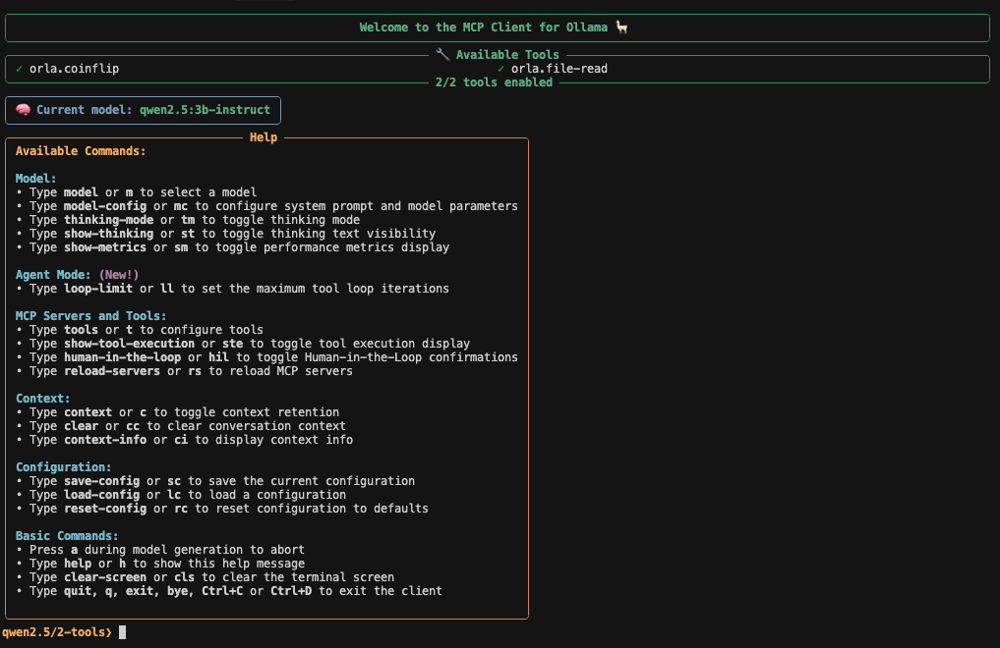
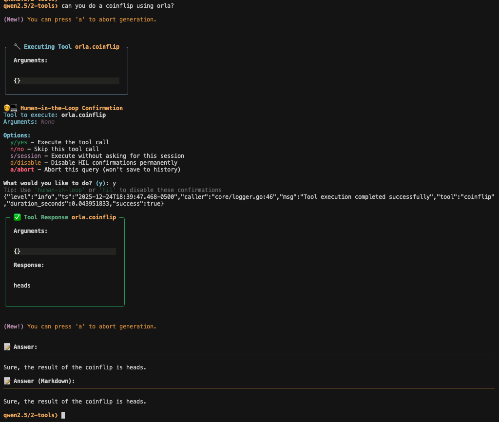

# Using Orla with MCP Client for Ollama

This guide will help you integrate Orla with [MCP Client for Ollama](https://github.com/jonigl/mcp-client-for-ollama), a text-based user interface (TUI) client designed for interacting with MCP servers using Ollama. This allows you to use your Orla tools with local LLMs through an interactive terminal interface.

## Prerequisites

- [MCP Client for Ollama](https://github.com/jonigl/mcp-client-for-ollama) installed
- [Ollama](https://ollama.ai/) installed and running
- Orla installed (see [Installation](#installation))
- At least one tool installed via Orla

## Installation

### Install Orla

First, install Orla:

```bash
go install github.com/dorcha-inc/orla/cmd/orla@latest
```

Or build from source:

```bash
git clone https://github.com/dorcha-inc/orla.git
cd orla
make install
```

Verify installation:

```bash
orla --version
```

### Install MCP Client for Ollama

Follow the installation instructions from the [MCP Client for Ollama repository](https://github.com/jonigl/mcp-client-for-ollama).

```bash
uvx ollmcp
```

## Install a tool

As an example, you can install a simple coinflip tool from Orla's registry:

```bash
orla install coinflip
```

Or install the file-read tool:

```bash
orla install file-read
```

## Configure Ollama

Before configuring MCP Client for Ollama, set up Ollama with a model that supports tool calling:

1. Install Ollama:

macOS:

```bash
brew install ollama
```

Linux:

```bash
curl -fsSL https://ollama.ai/install.sh | sh
```

2. Start Ollama:

```bash
ollama serve
```

Keep this running in a terminal, or run it as a background service.

3. Pull a model that supports tool calling:

```bash
ollama pull qwen2.5:3b-instruct
```

## Configure MCP Client for Ollama

Using the following command to get the absolute path for orla, i.e., `<ORLA_PATH>`:

```bash
which orla
```

create the following json file in `~/.config/ollmcp/mcp-servers/config.json`:

```json
{
  "mcpServers": {
    "orla": {
      "command": "<ORLA_PATH>",
      "args": ["serve", "--stdio"]
    }
  }
}
```

Next, you can run MCP Client for Ollama:

```bash
uvx ollmcp --model qwen2.5:3b-instruct
```

it should look like this:

</img>

you can test the tools:

</img>

## Getting Help

If you encounter issues, please feel free to ask for help in our [discord](https://discord.gg/bzKYCFewPT) or 
open a [github issue](https://github.com/dorcha-inc/orla/issues).

For issues specific to MCP Client for Ollama, check the [MCP Client for Ollama repository](https://github.com/jonigl/mcp-client-for-ollama).

## Related Documentation

- [README.md](../../README.md)
- [Claude Desktop Integration](./claude-desktop.md)
- [Examples](../../examples/)
- [RFC 1](../rfcs/rfc1.txt)
- [RFC 3](../rfcs/rfc3.txt)

